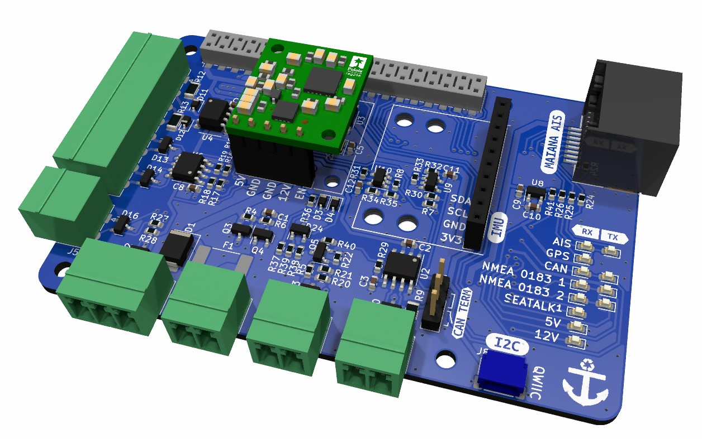
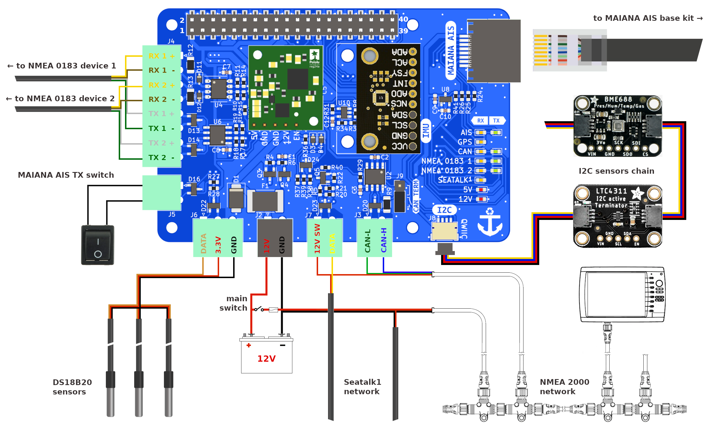

# MacArthur-HAT

After a few years of developing software for **OpenPlotter**, we have identified exactly what we need in terms of hardware to achieve our goals and the result is the **MacArthur HAT** (Hardware Attached on Top), an add-on board for **Raspberry Pi** running OpenPlotter. With this HAT we want to get the fully open-source boat to free ourselves from dependence on big companies and make our boats more respectful with the environment.

> __Note__
>
> KiCad files will be released when the board is in production.

> __Documentation__
>
> [Low resolution manual](Documentation_low.pdf)
>
> [High resolution manual](Documentation.pdf)

> __Buy__
>
> [**OpenMarine store** (Catalonia)](https://shop.openmarine.net/home/23-macarthur-hat.html)
> 
> [**Wegmatt store** (US)](https://shop.wegmatt.com/collections/openmarine)

> __Support__
>
> https://forum.openmarine.net/forumdisplay.php?fid=29

